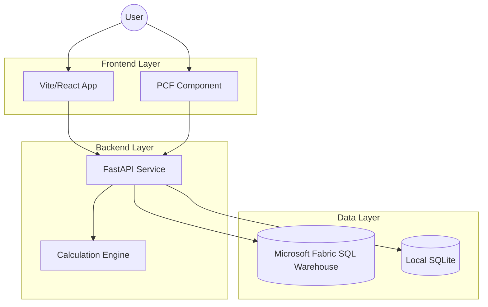

# Project Documentation: Forecasting with Directed Graphs

## 1. Executive Summary
The Directed Graph Forecasting App is a sophisticated financial modeling platform designed to map Key Performance Indicators (KPIs) into a Directed Acyclic Graph (DAG). It enables multi-year forecasting, scenario modeling, and recursive data distribution through an interactive UI and a robust cloud-integrated backend.

---

## 2. System Architecture

The project is structured into three specialized modules for maximum maintainability and deployment flexibility.



### Module Breakdown
- **[`backend/`](./backend)**: FastAPI service handling authentication, calculation, and persistence.
- **[`frontend/`](./frontend)**: Standalone React/Vite dashboard.
- **[`pcf/`](./pcf)**: Power Apps Component Framework projects for Dataverse integration.

---

## 3. Database & Data Consistency

### A. Microsoft Fabric SQL Warehouse
The system supports **Microsoft Fabric** as its primary cloud data store. It uses a "dual-mode" connection strategy in `backend/data/database.py`.

#### Connection String Logic
The backend detects the environment and builds the connection string dynamically:
- **Cloud**: Uses `ODBC Driver 18 for SQL Server` with `Encrypt=yes`.
- **Local Fallback**: Uses `sqlite:///./forecasting.db` if Fabric environment variables are missing.

### B. Entra ID (Azure AD) Authentication
Authentication to Fabric is **passwordless**, significantly increasing security.
- **Local Dev**: Token is fetched from Azure CLI (`az login`).
- **Cloud Dev**: Uses **Managed Identity** (System-assigned).
- **Implementation**: Uses `azure-identity`'s `DefaultAzureCredential`.

### C. Snapshot Isolation & Concurrency
Fabric SQL Warehouse uses snapshot isolation. To handle potential write conflicts during heavy calculation runs, the backend implements a **Retry Logic** in `api/projects.py` with exponential backoff.

---

## 4. Deployment Guides

### A. Backend Deployment (Azure)

#### 1. Containerization
The backend includes a production-ready `Dockerfile`.
```bash
# Build the image
docker build -t forecasting-backend ./backend
```

#### 2. Azure App Service / Container Apps
1.  **Push to ACR**: Push the image to an Azure Container Registry.
2.  **Deploy**: Create an "App Service for Containers" or "Azure Container App".
3.  **Environment Variables**:
    - `FABRIC_SERVER`: Your Fabric endpoint.
    - `FABRIC_DATABASE`: Your warehouse name.
    - `PORT`: Usually 8080 (backend auto-detects this).
4.  **Identity**: Enable **System-Assigned Managed Identity** in the Azure portal for the app, and grant it `Contributor` or `SQL Contributor` access to the Fabric Warehouse.

### B. Power Platform Deployment (PAC CLI)

#### 1. Prerequisites
Ensure you have the [Power Platform CLI (PAC)](https://aka.ms/PowerPlatformCLI) installed.

#### 2. Build & Push Flow
Navigate to the PCF project:
```powershell
cd pcf/forecasting-pcf
npm install
npm run build
# Authenticate
pac auth create --url https://yourorg.crm.dynamics.com
# Push directly for testing
pac pcf push --publisher-prefix dev
```

#### 3. Solution Packaging
For production-grade deployment:
1.  Initialize a solution project: `pac solution init --publisher-name MyPublisher --publisher-prefix mp`
2.  Add reference to PCF: `pac solution add-reference --path ../forecasting-pcf`
3.  Build solution: `dotnet build` (generates a `.zip` file in `bin/Debug` or `bin/Release`).
4.  Import the zip file into your Power Apps environment.

---

## 5. Domain Logic: Weighted Distribution

The core of the app is the distribution of KPI targets. When a parent node value is changed:
1.  **Direct Child Update**: Values are distributed to immediate children.
2.  **Weighted Approach**: If children already have values, the change is distributed proportionally (Weighted). If children are zero, the change is distributed equally.
3.  **Locks**: If a child month is locked, the calculator bypasses that month and redistributes the target among unlocked months.

---

## 6. Troubleshooting

| Issue | Cause | Resolution |
| :--- | :--- | :--- |
| `ODBC Driver Error` | Missing Driver | Install "ODBC Driver 18 for SQL Server" on host or container. |
| `401 Unauthorized` | Expired Token | Run `az login` to refresh local credential cache. |
| `Snapshot Conflict` | Parallel Writes | Backend will retry 3 times; reduce concurrency if frequent. |
| `API Not Found` | Port Mismatch | Ensure `VITE_API_URL` in frontend matches backend port (default 8000). |
