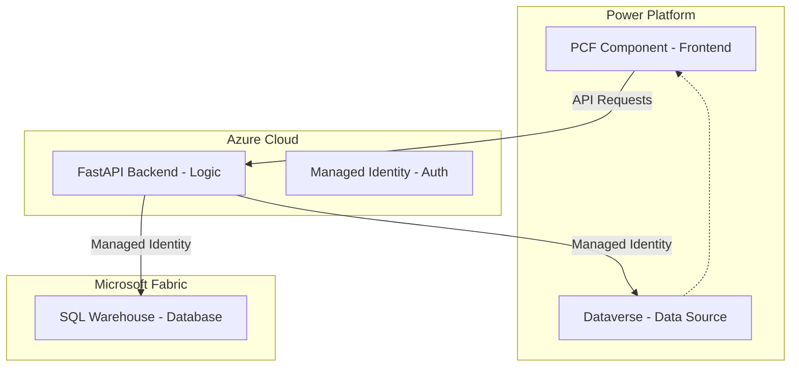
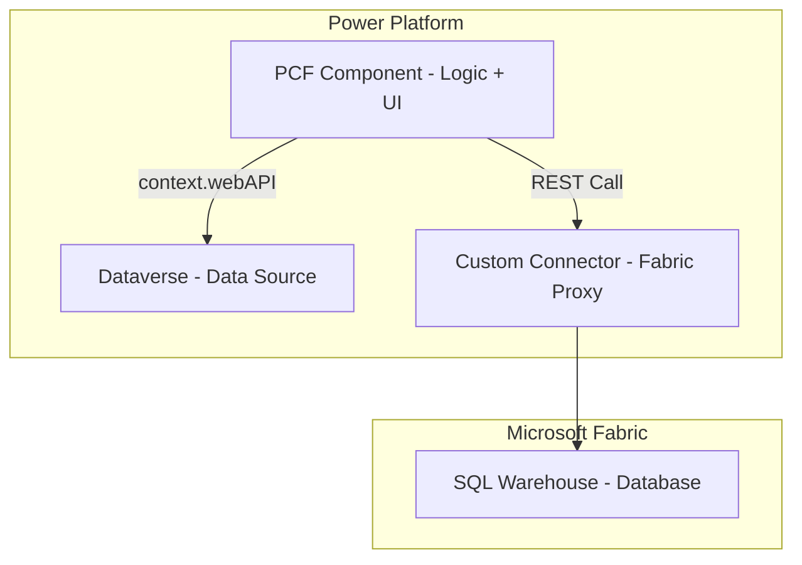

# Architecture & Hosting Strategy: Directed Graph Forecasting

This document outlines the two primary scenarios for production hosting of the Directed Graph Forecasting platform within the Microsoft ecosystem.

---

## Scenario 1: Hybrid Architecture (Python on Azure)
**Best for:** Maintaining complex calculation logic and high-performance financial modeling.

### 1. Architecture Overview

### 2. Hosting & Deployment
| Component | Hosting Location | How to Host |
| :--- | :--- | :--- |
| **Frontend** | Power Apps (PCF) | Import as a Solution (.zip) into your Power Platform environment. |
| **Backend** | Azure App Service | Deploy as a **"Web App for Containers"** using the existing `Dockerfile`. |
| **Database** | Microsoft Fabric | Create a **SQL Warehouse** in a Fabric Workspace. |

### 3. Dataverse Integration & Hierarchy Builder
*   **Connectivity:** The Python backend fetches data using the **Power Platform Web API**.
*   **Intuitive Mapping:** Instead of manual CSV column selection (L1, L2), users see a list of Dataverse fields.
*   **Drag & Drop Hierarchy:** You can drag fields (e.g., `Product Category`, `Region`) into a "Hierarchy Bin" to define the tree structure visually.
*   **Automatic Sync:** Once mapped, the backend pulls fresh data on a schedule or on-demand without re-uploading files.

### 4. Authentication & Security
*   **No Manual Login:** The Azure App Service uses a **System-Assigned Managed Identity**.
*   **Permission Flow:**
    1.  The Identity is added as a "Contributor" to the Fabric Workspace.
    2.  The Identity is added as an **Application User** in Power Platform to read Dataverse tables.
*   **Result:** The backend "just works" without developers needing to manage passwords or connection strings.

---

## Scenario 2: Native Architecture (Full React Rewrite)
**Best for:** Reducing hosting costs and keeping everything inside one tenant/subscription.

### 1. Architecture Overview

### 2. Hosting & Deployment
| Component | Hosting Location | How to Host |
| :--- | :--- | :--- |
| **Frontend + Logic** | Power Apps (PCF) | All `numpy`/`pandas` logic is rewritten in TypeScript and bundled in the PCF. |
| **Backend** | N/A | There is no separate backend server. |
| **Database** | Microsoft Fabric | Create a **SQL Warehouse** and expose it via a **Custom Connector** or **Virtual Tables**. |

### 3. Dataverse Integration & Hierarchy Builder
*   **Connectivity:** The PCF component uses the native `context.webAPI` to browse and fetch Dataverse tables directly.
*   **Field Mapping UI:** A React-based drag-and-drop interface allows you to map Dataverse columns to KPI nodes.
*   **No File Imports:** You select a Dataverse "View" (e.g., "Active Sales Forecast"), and the app builds the graph instantly.

### 4. Authentication & Security
*   **User Identity:** The app runs under the context of the logged-in user.
*   **Permissions:** The user must have "Read/Write" access to both Dataverse and the Fabric SQL Warehouse.
*   **Limitation:** Client-side JavaScript cannot connect directly to Fabric SQL via TDS protocol; it must go through an intermediate Power Automate flow or Custom Connector.

---

## Summary Comparison

| Feature | Scenario 1 (Hybrid) | Scenario 2 (Native) |
| :--- | :--- | :--- |
| **Logic Portability** | Easy (Keep current Python code) | Hard (Full rewrite of Calc Engine) |
| **Performance** | High (Managed by Azure scaling) | Limited by browser/device CPU |
| **Hosting Cost** | Low-Medium (Azure Service fees) | Zero (Included in Power Apps license) |
| **Complexity** | Distributed (2 services) | Centralized (1 service) |
| **Auth Experience** | Seamless (Managed Identity) | Standard (User-based) |

---

## Recommendation

**I recommend Scenario 1 (Hybrid).** 
The core value of your platform is the recursive DAG calculation engine. Translating the mathematical nuances of `pandas` and `numpy` into JavaScript is prone to errors and would require extensive testing to ensure ROI/KPI calculations match your existing Python/Excel models.
